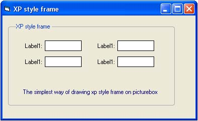

<div align="center">

## drawing XP style frame on picturebox


</div>

### Description

In this project I want to show you a simple way of drawing xp style frame on picture box using api functions. I hope it will be useful for you.
 
### More Info
 


<span>             |<span>
---                |---
**Submitted On**   |2005-12-21 12:40:12
**By**             |[Juan Carlos San Román](https://github.com/Planet-Source-Code/PSCIndex/blob/master/ByAuthor/juan-carlos-san-rom-n.md)
**Level**          |Beginner
**User Rating**    |4.9 (34 globes from 7 users)
**Compatibility**  |VB 5\.0, VB 6\.0
**Category**       |[Windows API Call/ Explanation](https://github.com/Planet-Source-Code/PSCIndex/blob/master/ByCategory/windows-api-call-explanation__1-39.md)
**World**          |[Visual Basic](https://github.com/Planet-Source-Code/PSCIndex/blob/master/ByWorld/visual-basic.md)
**Archive File**   |[drawing\_XP19584912212005\.zip](https://github.com/Planet-Source-Code/juan-carlos-san-rom-n-drawing-xp-style-frame-on-picturebox__1-63739/archive/master.zip)

### API Declarations

```
Private Declare Function RoundRect Lib "gdi32" _
  (ByVal hDC As Long, ByVal Left As Long, ByVal Top As Long, _
   ByVal Right As Long, ByVal Bottom As Long, ByVal EllipseWidth As Long, _
   ByVal EllipseHeight As Long) As Long
Private Declare Function LineTo Lib "gdi32" (ByVal hDC As Long, ByVal X As Long, ByVal Y As Long) As Long
Private Declare Function MoveToEx Lib "gdi32" (ByVal hDC As Long, ByVal X As Long, ByVal Y As Long, lpPoint As POINTAPI) As Long
Private Declare Function DrawTextEx Lib "user32" Alias "DrawTextExA" (ByVal hDC As Long, ByVal lpsz As String, ByVal n As Long, lpRect As RECT, ByVal un As Long, lpDrawTextParams As Any) As Long
Private Declare Function SetRect Lib "user32" (lpRect As RECT, ByVal X1 As Long, ByVal Y1 As Long, ByVal X2 As Long, ByVal Y2 As Long) As Long
```


